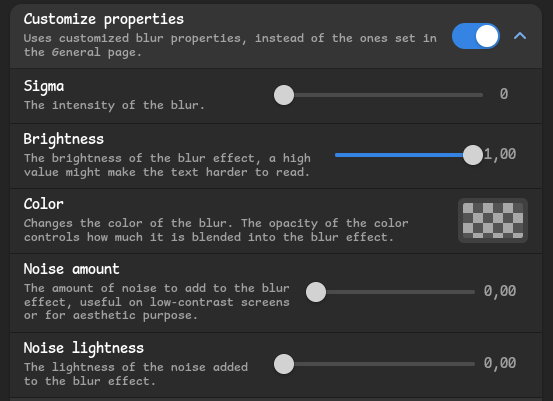
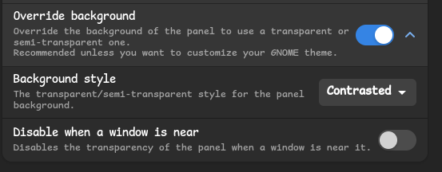

# dotfiles-gnome-12

> this is my gnome dotfile.

## INFO

-  **OS** - Debian 12
-  **Desktop Environment** - GNOME
-  **Panel** - Gnome Panel
    
    using [Blur-my-Shell](https://extensions.gnome.org/extension/3193/blur-my-shell/">Blur-my-Shell)
    

    # Make sure go to _Panel_ section.
    + change inside _Customize Properties_.
        

    + change inside _Override background_.
        

-  **File Manager** - Thunar
-  **Terminal** - Kitty
-  **Shell** - starship
- **Text Editor** - vim & vscode
- **Theme** - [WhiteSur-gtk-theme](https://github.com/vinceliuice/WhiteSur-gtk-theme)